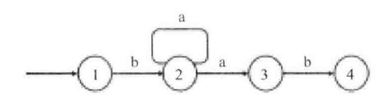

## [10. Regular Expression Matching](https://leetcode.com/problems/regular-expression-matching/)

[toc]

> Given an input string (`s`) and a pattern (`p`), implement regular expression matching with support for `'.'` and `'*'`.
>
> ```
> '.' Matches any single character.
> '*' Matches zero or more of the preceding element.
> ```
>
> The matching should cover the **entire** input string (not partial).
>
> **Note:**
>
> - `s` could be empty and contains only lowercase letters `a-z`.
> - `p` could be empty and contains only lowercase letters `a-z`, and characters like `.` or `*`.
>
> **Example 1:**
>
> ```
> Input:
> s = "aa"
> p = "a"
> Output: false
> Explanation: "a" does not match the entire string "aa".
> ```
>
> **Example 2:**
>
> ```
> Input:
> s = "aa"
> p = "a*"
> Output: true
> Explanation: '*' means zero or more of the preceding element, 'a'. Therefore, by repeating 'a' once, it becomes "aa".
> ```
>
> **Example 3:**
>
> ```
> Input:
> s = "ab"
> p = ".*"
> Output: true
> Explanation: ".*" means "zero or more (*) of any character (.)".
> ```
>
> **Example 4:**
>
> ```
> Input:
> s = "aab"
> p = "c*a*b"
> Output: true
> Explanation: c can be repeated 0 times, a can be repeated 1 time. Therefore, it matches "aab".
> ```
>
> **Example 5:**
>
> ```
> Input:
> s = "mississippi"
> p = "mis*is*p*."
> Output: false
> ```
>
> ```
> /**
>  * @param {string} s
>  * @param {string} p
>  * @return {boolean}
>  */
> var isMatch = function(s, p) {
>     
> };
> ```

## Solution 状态机

要点：

1. 递归
2. 举例
3. 特例："" 与 "p\*" 、 “a”与"ab\*b\*"

```javascript
/**
 * @param {string} s
 * @param {string} p
 * @return {boolean}
 */
var isMatch = function(s, p) {
    let lenS = s.length,lenP = p.length
    if(lenS === 0 && lenP ===2 && p[1] === "*") // 特殊判断
        return true;
	if(lenP === 0 && lenS !== 0)
        return false;
    return matchDetect(0,0);
    
    function matchDetect(curS,curP){ 
        if(curS === lenS && curP === lenP)
            return true;
        if(curS === lenS){ // 虽然不能连续****,但是可以b*b*b* (a,ab*b*) a已经相等
            // (curP+2 === lenP && p[curP+1] === "*")
            for(let i=curP;i<lenP;i+=2){
                if(p[i+1] !== "*") return false;
            }
            return true; 
        }
        
        if((curS === lenS && curP !== lenP) || (curS !== lenS && curP === lenP)){
            return false;
        }
        if(curP+1 < lenP && p[curP+1] === "*"){
            //if(p[curP] === s[curS]) // (ab, a*b)
            //	return matchDetect(curS+1,curP+2) // (ab, a*b)
            //		|| matchDetect(curS+1,curP) //(aab, a*b)
            //		|| matchDetect(curS, curP+2)//(b, a*b)
           	//if(p[curP] === ".") // (ab, .*b)
            //    return matchDetect(curS+1,curP+2) // (ab, .*b)
            //		|| matchDetect(curS+1,curP) // (aab, .*b)
            //		|| matchDetect(curS,curP+2) //(b, .*b)
            if(p[curP] === s[curS] || p[curP] === ".") 
                return matchDetect(curS+1,curP+2) 
            		|| matchDetect(curS+1,curP) 
            		|| matchDetect(curS,curP+2)
            else // (i, p*i)
                return matchDetect(curS,curP+2)
        }else if(curP<lenP){
            if(p[curP] === ".")
                return matchDetect(curS+1,curP+1)
            else if(p[curP] === s[curS])
                return matchDetect(curS+1,curP+1)
            else 
                return false;
        }
        return false;
    }
};
```

```
Runtime: 1960 ms, faster than 5.07% of JavaScript online submissions for Regular Expression Matching.
Memory Usage: 35.5 MB, less than 100.00% of JavaScript online submissions for Regular Expression Matching.
```

可以看到空间复杂度是很低的，但是时间复杂度很高O(n*m)

以上代码考虑了很多情况，也浪费了我很长时间（大约两个小时）。


## solution DP

Here are some conditions to figure out, then the logic can be very straightforward.

```java
1, If p.charAt(j) == s.charAt(i) :  dp[i][j] = dp[i-1][j-1];
2, If p.charAt(j) == '.' : dp[i][j] = dp[i-1][j-1];
3, If p.charAt(j) == '*': 
   here are two sub conditions:
               1   if p.charAt(j-1) != s.charAt(i) : dp[i][j] = dp[i][j-2]  //a* only counts as empty
               2   if p.charAt(i-1) == s.charAt(i) or p.charAt(i-1) == '.':
                              dp[i][j] = dp[i-1][j]    //a* counts as multiple a 
                           or dp[i][j] = dp[i][j-1]   // a* counts as single a
                           or dp[i][j] = dp[i][j-2]   // a* counts as empty
```

```javascript
/**
 * @param {string} s
 * @param {string} p
 * @return {boolean}
 */
var isMatch = function(s, p) {
    let lenS = s.length,lenP = p.length;
    let dp = Create2DArray(lenS+1);
    dp[0][0] = true;
    
}

function Create2DArray(rows){
    var arr = [];
    
    for(let i=0;i<rows;i++){
        arr[i] = [];
    }
    return arr;
}
```


## 书上参考

问题与上面相同。

每次从字符串里拿出一个字符和模式中的字符去匹配。如何匹配一个字符？：

如果模式中的字符是"."，那么它可以匹配字符串中的任意字符。

如果模式中对应的字符和字符串中的字符相同， 则相互匹配。然后，继续匹配后面的字符。

当模式的第二个字符是"\*"时，可能有多种不同的匹配方式。一种选择是在模式上向后移动两个字符。这相当于"\*"和它前面的字符被忽略了，因为"\*"可以匹配字符串中的0个字符。如果模式中的第一个字符和字符串中的第一个字符相匹配，则在字符串上向后移动一个字符，而在模式上有两种选择：可以在模式上向后移动两个字符，也可以保持模式不变。



如上图是模式ba*ab的**非确定有限状态机**；当匹配进入状态2并且字符串的字符是"a"时，有两种选择：可以进入状态3（模式上向后移动两个字符串），也可以回到状态2（模式保持不变）。

以下是书上代码参考，但是没有通过测试。

```javascript
/**
 * @param {string} s
 * @param {string} p
 * @return {boolean}
 */
var isMatch = function(s, p) {
    let lenS = s.length,lenP = p.length
	if(lenS === 0 || lenP === 0)
        return false;
    return matchDetect(0,0);
    
    function matchDetect(curS,curP){ 
        if(curS === lenS && curP === lenP) // s与p都遍历结束
            return true;
        if(curS !== lenS && curP === lenP) // s没有遍历结束，p遍历结束
            return false;
        if(p[curP+1] === "*"){ // 如果模式的下一个是*
            if(s[curS] === p[curP] || (p[curP] === "." && curS !== lenS)){
                return matchDetect(curS+1,curP+2) // 进入下一个状态 (ab, a*) 
                	|| matchDetect(curS+1,curP) // *前的字符串重复 保持当前状态 (aa, a*)
                	|| matchDetect(curS,curP+2) // *前的字符重复0次 (b, a*)
            }else // (b,a*)
                return matchDetect(curS,curP+2) // *前的字符重复0次
        }
        
        // 如果下一个模式不是*  (abc,abc)
        if(s[curS] === p[curP] || (p[curP]==="." && curS!==lenS))
            return matchDetect(curS+1,curP+1);
   		
        return false;
    }
};
```


