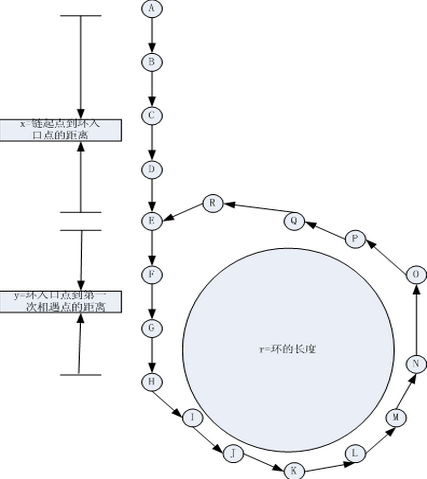

# [142. Linked List Cycle II](https://leetcode.com/problems/linked-list-cycle-ii/)

> Given a linked list, return the node where the cycle begins. If there is no cycle, return `null`.
>
> To represent a cycle in the given linked list, we use an integer `pos` which represents the position (0-indexed) in the linked list where tail connects to. If `pos` is `-1`, then there is no cycle in the linked list.
>
> **Note:** Do not modify the linked list.
>
>  **Example 1:**
>
> ```
>Input: head = [3,2,0,-4], pos = 1
> Output: tail connects to node index 1
> Explanation: There is a cycle in the linked list, where tail connects to the second node.
> ```
> 
> 
>
> **Example 2:**
>
> ```
>Input: head = [1,2], pos = 0
> Output: tail connects to node index 0
> Explanation: There is a cycle in the linked list, where tail connects to the first node.
> ```
> 
> 
>
> **Example 3:**
>
> ```
>Input: head = [1], pos = -1
> Output: no cycle
> Explanation: There is no cycle in the linked list.
> ```
> 
> 
>
> 
>
>  **Follow-up**:
>Can you solve it without using extra space?
> 
> ```javascript
>/**
>  * Definition for singly-linked list.
>  * function ListNode(val) {
>  *     this.val = val;
>  *     this.next = null;
>  * }
>  */
> 
> /**
>  * @param {ListNode} head
>  * @return {ListNode}
>  */
> var detectCycle = function(head) {
>     
> };
> ```


## Solution 1

```javascript
var detectCycle = function(head) {
    let encounter;
    if(ExistCycle() === false) return null; // 不存在环
    
    let p1 = head, p2 = encounter;
    while(p1 !== p2){
        p1 = p1.next
        p2 = p2.next
    }
    return p1;
    
    function ExistCycle(){
        let fast = head,slow = head;
        while(fast && fast.next){
            fast = fast.next.next;
            slow = slow.next;
            if(fast === slow){
                encounter = fast;	// 记录相遇指针
                return true;
            }
        }
        encounter = null;
        return false;
    }
};
Runtime: 60 ms, faster than 94.99% of JavaScript online submissions for Linked List Cycle II.
Memory Usage: 37.2 MB, less than 31.25% of JavaScript online submissions for Linked List Cycle II.
```


## 书上参考：

1. 判断是否存在环：

   设一快一慢两个指针（Node *fast, *low）同时从链表起点开始遍历，其中快指针每次移动长度为2，慢指针则为1。则若无环，开始遍历之后fast不可能与low重合，且fast或fast->next最终必然到达NULL；若有环，则fast必然不迟于low先进入环，且由于fast移动步长为2，low移动步长为1，则在low进入环后继续绕环遍历一周之前fast必然能与low重合，且必然是第一次重合，证明如下：

   首先，由于链表是个环，所以相遇的过程可以看作是快指针从后边追赶慢指针的过程。那么做如下思考：

   - 快指针与慢指针之间差一步。此时继续往后走，慢指针前进一步，快指针前进两步，两者相遇。

   - 快指针与慢指针之间差两步。此时唏嘘往后走，慢指针前进一步，快指针前进两步，两者之间相差一步，转化为第一种情况。

   - 快指针与慢指针之间差N步。此时继续往后走，慢指针前进一步，快指针前进两步，两者之间相差(N+1-2)-> N-1步。

     因此，此题得证。所以快指针必然与慢指针相遇。又因为快指针速度是慢指针的两倍，所以相遇时必然只绕了一圈。

   另一种想法：用两个移动的指针可以确保：如果有环的话两个指针都会进入有环的部分。一旦进入有环的部分，一快一慢，就相当于一个静止另一个移动。

   ```javascript
       function ExistCycle(){
           let fast = head,slow = head;
           while(fast && fast.next){
               fast = fast.next.next;
               slow = slow.next;
               if(fast === slow)
                   encounter = fast;	// 记录相遇指针
                   return true;
           }
           encounter = null;
           return false;
       }
   ```

   

2. 找到环的入口：

   如下图，如图中所示，设链起点到环入口点间的距离为x，环入口点到问题1中fast与low重合点的距离为y，又设在fast与low重合时fast已绕环n周（n>0），且此时low移动总长度为s，则fast移动总长度为2s，环的长度为r。则`s+nr = 2s`  `s = x+y` => `s = nr` `nr = x+y`

   现让一指针p1从链表起点处开始遍历，指针p2从encounter处开始遍历，且p1和p2移动步长均为1。

   则当p1移动x步即到达环的入口点，由`nr = x+y`可知`x = nr-y`，此时p2也已移动x步或者说nr - y步。由于p2是从encounter处开始移动，故p2移动nr步是移回到了encounter处，再退y步则是到了环的入口点。也即，当p1移动x步第一次到达环的入口点时，p2也恰好到达了该入口点。

   

   